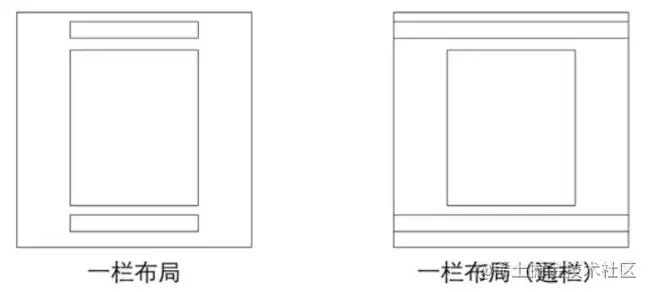

# flex布局

+ flex 是 flexible Box 的缩写，意为"弹性布局"，用来为盒状模型提供最大的灵活性，任何一个容器都可以指定为 flex 布局。
+ 当我们为父盒子设为 flex 布局以后，子元素的 float、clear 和 vertical-align 属性将失效。
+ flex布局又叫伸缩布局 、弹性布局 、伸缩盒布局 、弹性盒布局 
+ 采用 Flex 布局的元素，称为 Flex 容器（flexcontainer），简称"容器"。它的所有子元素自动成为容器成员，称为 Flex 项目（flexitem），简称"项目"。

**总结**：就是通过给父盒子添加flex属性，来控制子盒子的位置和排列方式

## 父元素属性：

#### flex-direction设置主轴的方向

row：从左到右（默认值）

row-reverse：从右向左

column：从上到下

column-reverse：从下到上

#### justify-content设置主轴上的子元素排列方式

flex-start：贴着主轴头部

flex-end：贴着主轴尾部

center：在主轴居中对齐

space-around：平分剩余空间

space-between：先两边贴边，再平分剩余空间

#### flex-wrap设置是否换行

默认情况下，项目都排在一条线上，不会换行。

nowrap：不换行（默认）

wrap：换行

#### align-items 设置侧轴上的子元素排列方式（单行 ）

该属性是控制子项在侧轴上的排列方式  在子项为单行的时候使用。

flex-start：贴着侧轴头部

flex-end：贴着侧轴尾部

center：在侧轴居中

stretch：拉伸（子项元素高度平分父元素高度）

#### align-content设置侧轴上的子元素的排列方式（多行）

flex-start：贴着侧轴头部

flex-end：贴着侧轴尾部

center：在侧轴居中

stretch：拉伸（子项元素高度平分父元素高度）

space-around：子项在侧轴平分剩余空间

space-between：子项在侧轴先分布在两侧，再平分剩余空间

#### flex-flow属性是flex-direction和flex-wrap属性的复合属性

如flex-flow:row wrap;

## 子元素属性：

#### flex子元素占的份数

flex属性定义子元素分配剩余空间，用flex的值表示占多少份

默认为0

#### align-self控制子元素自己在侧轴上的排列方式

align-self 属性允许单个项目有与其他项目不一样的对齐方式，可覆盖 align-items 属性。

默认值为 auto，表示继承父元素的 align-items 属性，如果没有父元素，则等同于 stretch。

flex-start：贴着侧轴头部

flex-end：贴着侧轴尾部

center：在侧轴居中

stretch：拉伸（子项元素高度平分父元素高度）

#### order属性定义项目的排列顺序

数值越小，排列越靠前，默认为0。

# 单列布局



## 1.header、content和footer等宽

第一步：对header,content,footer统一设置***width：1000px***或***max-width：1000px***

第二步：对header,content,footer统一设置***margin:0 auto***即可

```html
<div class="header"></div>
<div class="content"></div>
<div class="footer"></div>
```

```css
.header{
    margin:0 auto; 
    max-width: 960px;
    height:100px;
    background-color: blue;
}
.content{
    margin: 0 auto;
    max-width: 960px;
    height: 400px;
    background-color: aquamarine;
}
.footer{
    margin: 0 auto;
    max-width: 960px;
    height: 100px;
    background-color: aqua;
}
```

## 2.header与footer等宽,content略窄

第一步：header、footer的内容宽度不设置，块级元素充满整个屏幕（也可使用max-width限定一下）

第二步：注意header、footer中的内容区域宽度要和content一致

第三步：对header的内容区域、footer的内容区域和content设置***margin：0 auto;***居中

```html
<div class="header">
    <div class="nav"></div>
</div>
<div class="content"></div>
<div class="footer"></div>
```

```css
.header{
    margin:0 auto;
    max-width: 960px;
    height:100px;
    background-color: blue;
}
.nav{
    margin: 0 auto;
    max-width: 800px;
    background-color: darkgray;
    height: 50px;
}
.content{
    margin: 0 auto;
    max-width: 800px;
    height: 400px;
    background-color: aquamarine;
}
.footer{
    margin: 0 auto;
    max-width: 960px;
    height: 100px;
    background-color: aqua;
}
```

# 两列布局

## 两栏自适应布局

两栏自适应布局即一列由内容撑开，另一列撑满剩余宽度的布局方式

### 1.float+overflow:hidden实现

主要通过***overflow:hidden***触发BFC，而BFC不会重叠浮动元素。

通过以下代码，left由内容撑开，right占据剩余所有宽度

```html
<div class="parent" style="background-color: lightgrey;">
    <div class="left" style="background-color: lightblue;">
        <p>left</p>
    </div>
    <div class="right"  style="background-color: lightgreen;">
        <p>right</p>
        <p>right</p>
    </div>        
</div>
```

```css
.parent {
  overflow: hidden;
}
.left {
  float: left;
  margin-right: 20px;
}
.right {
  overflow: hidden;
}
```

## 2.flex布局实现

```html
<div class="parent" style="background-color: lightgrey;">
    <div class="left" style="background-color: lightblue;">
        <p>left</p>
    </div>
    <div class="right"  style="background-color: lightgreen;">
        <p>right</p>
        <p>right</p>
    </div>        
</div>
```

```css
.parent {
  display:flex;
}  
.right {
  margin-left:20px; 
  flex:1;
}
```

# 三栏布局

三栏布局特征是：两侧固定宽度，中间自适应宽度

## 1.圣杯布局

比较特殊的三栏布局，同样也是两边固定宽度，中间自适应，唯一区别是dom结构必须是先写中间列部分，这样实现中间列可以优先加载。

HTML:

```html
  <article class="container">
    <div class="center">
      <h2>圣杯布局</h2>
    </div>
    <div class="left"></div>
    <div class="right"></div>
  </article>
```

第一步：设置三栏的父盒子的左右padding，为左右两栏流出空间。

第二步：三个部分都设定为**左浮动**，否则左右两边内容上不去，就不可能与中间列同一行。然后**设置center的宽度为100%**(实现中间列内容自适应)，此时，left和right部分会跳到下一行。

第三步：通过设置margin-left为负值让left和right部分回到与center部分同一行，设置margin-left为负值可以让其向前移动，left的负值应该是center的宽度，也就是100%，right的负值应该是自身的宽度。

第四步：通过设置相对定位，让left和right部分移动到两边。

CSS：

```css
  .container {
    padding-left: 220px;//为左右栏腾出空间
    padding-right: 220px;
  }
  .left {
    float: left;
    width: 200px;
    height: 400px;
    background: red;
    margin-left: -100%;
    position: relative;
    left: -220px;
  }
  .center {
    float: left;
    width: 100%;
    height: 500px;
    background: yellow;
  }
  .right {
    float: left;
    width: 200px;
    height: 400px;
    background: blue;
    margin-left: -200px;
    position: relative;
    right: -220px;
  }
```

缺点：

- center部分的最小宽度不能小于left部分的宽度，否则会left部分掉到下一行
- 如果其中一列内容高度拉长(如下图)，其他两列的背景并不会自动填充。(借助等高布局正padding+负margin可解决，下文会介绍)

## 2.双飞翼布局

同样也是三栏布局，在圣杯布局基础上进一步优化，解决了圣杯布局错乱问题，实现了内容与布局的分离。而且任何一栏都可以是最高栏，不会出问题。

HTML：

```html
    <article class="container">
        <div class="center">
            <div class="inner">双飞翼布局</div>
        </div>
        <div class="left"></div>
        <div class="right"></div>
    </article>
```

CSS：

```css
    .container {
        min-width: 600px;//确保中间内容可以显示出来，两倍left宽+right宽
    }
    .left {
        float: left;
        width: 200px;
        height: 400px;
        background: red;
        margin-left: -100%;
    }
    .center {
        float: left;
        width: 100%;
        height: 500px;
        background: yellow;
    }
    .center .inner {
        margin: 0 200px; //新增部分
    }
    .right {
        float: left;
        width: 200px;
        height: 400px;
        background: blue;
        margin-left: -200px;
    }
```

